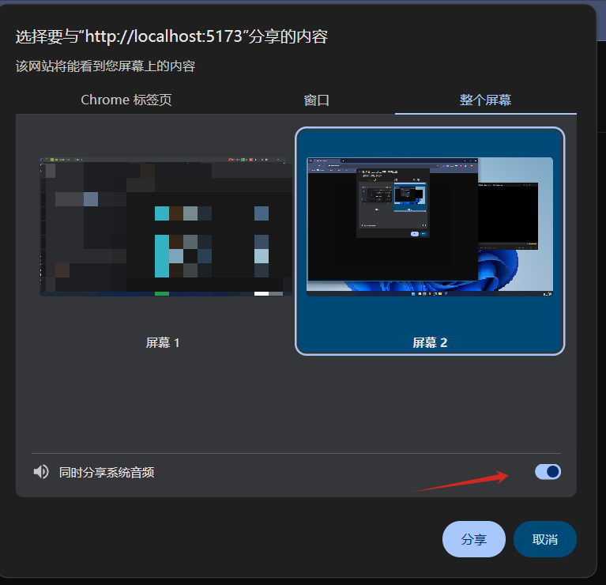

# whisper-web-pure

it is a web-based application that allows users to transcribe audio files using OpenAI's Whisper model. 
The application is built using pure HTML, CSS, and JavaScript, making it easy to deploy and use without any server-side dependencies.

1. get voice via chrome api
2. convert to special format which is compatible with whisper
3. send to `@huggingface/transformers` to transcribe

## demo video
<video src="./doc/demo.mp4" controls width="600"></video>

## Notes:

- it is not totally accurate. 
- it is just a tools that demonstrate how to use whisper model in web browser.
- but it is enough for me to get more understanding in meeting.

## solutions

this one is the simplest solution I can think of to achieve the goal of transcribing audio using Whisper model in web browser.

belows are other solution,but too complex:
1. ffmpeg + af_whisper
2. ffmpeg + nodejs-whisper

but ffmpeg cannot record system audio directly if you don't install 3rd party audio driver.
